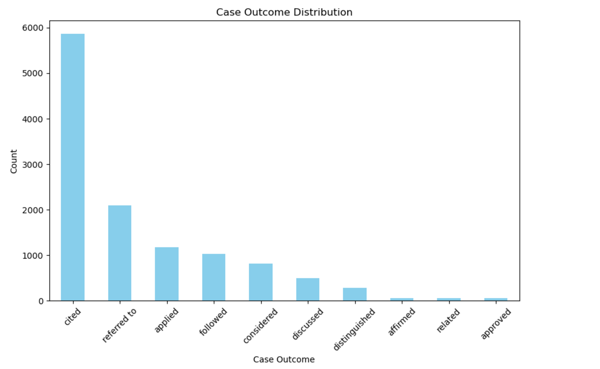
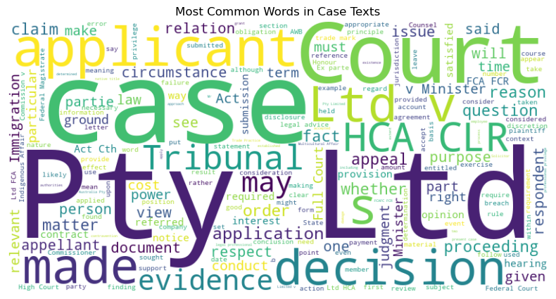
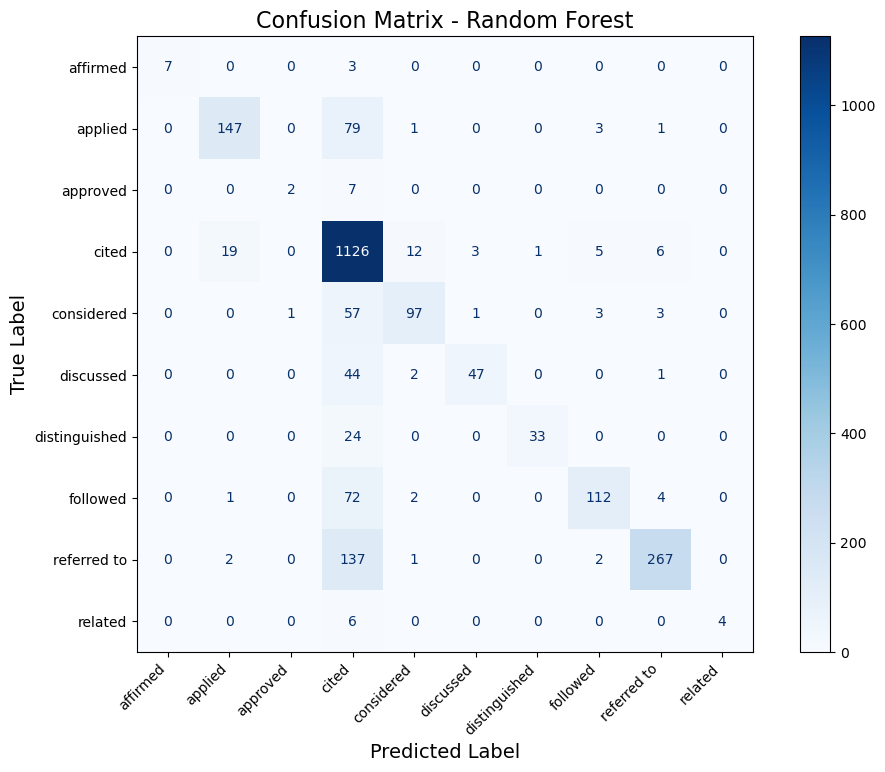
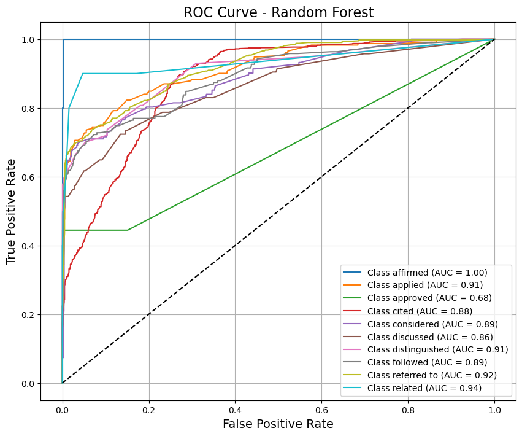
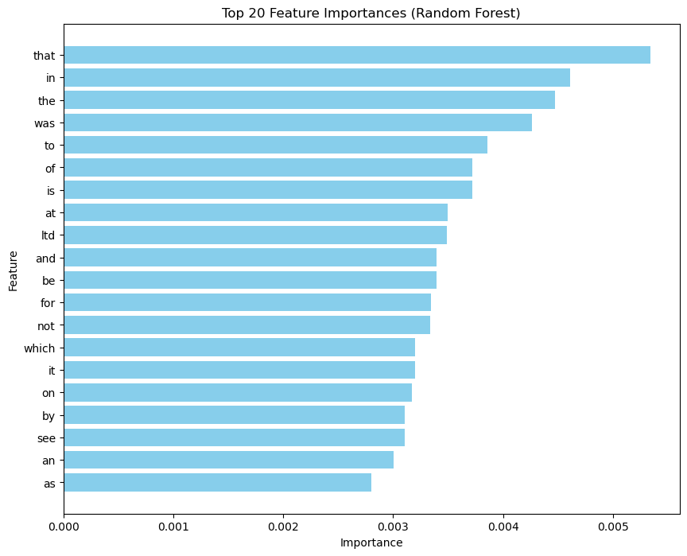

# Legal Case Outcome Prediction System

Machine learning pipeline for predicting legal case outcomes using natural language processing and supervised learning. Built for my ISTE 470 (Data Science Programming) final project at RIT, Fall 2024.

Given the text of an Australian court case citation, the model predicts how that citation was treated by a later case — e.g. `cited`, `applied`, `followed`, `distinguished`, `affirmed` — using ~12,000 labeled case texts.

## Highlights

- Applied text preprocessing (lowercasing, non-alphabetic noise removal, class balancing via upsampling, TF-IDF vectorization with a 5,000-term vocabulary) to build ML-ready features from raw case text
- Achieved **78% accuracy** and a **0.78 weighted F1-score** with a tuned Random Forest classifier (`n_estimators=150`, balanced class weights) — the strongest of the models tested
- Also trained and evaluated Logistic Regression (71% accuracy, best variant) and a linear SVM (53% accuracy) as comparison baselines
- Diagnosed and addressed severe class imbalance (`cited` outnumbers rare classes like `approved` by >100x) via minority-class upsampling and `class_weight='balanced'`

## Dataset

~12,000 Australian Federal Court case citations (`case_id`, `case_outcome`, `case_title`, `case_text`), labeled with one of 10 outcome classes. Heavily imbalanced — `cited` alone accounts for roughly half of all records.



## Pipeline

1. **Cleaning** — drop rows with missing `case_text`, lowercase, strip non-alphabetic characters
2. **Class balancing** — upsample minority outcome classes to reduce skew before vectorization
3. **Feature extraction** — TF-IDF vectorization, capped at 5,000 features
4. **Modeling** — Random Forest (primary), Logistic Regression and SVM (comparison), plus a KMeans clustering pass for exploration
5. **Evaluation** — accuracy, weighted F1, per-class precision/recall/F1, confusion matrices, and ROC/AUC curves



## Results

| Model | Accuracy | Weighted F1 |
|---|---|---|
| **Random Forest (tuned)** | **78.6%** | **0.78** |
| Logistic Regression (best variant) | 71.4% | — |
| Linear SVM | 53.4% | — |

Random Forest handled the class imbalance and short/long text-length variance in the dataset noticeably better than the linear models, especially on frequent classes (`cited`, `referred to`, `applied`).





The top TF-IDF terms driving Random Forest's predictions were dominated by procedural/citation language rather than case-specific facts, which tracks with the task being about *how* a case was cited rather than its subject matter:



## Project Structure

```
Legal-Case-Outcome-Prediction-System/
├── legal_case_classification.ipynb          # Full pipeline: EDA, preprocessing, training, evaluation
├── legal_text_classification.csv              # ~12k labeled Australian case citations
├── Legal_Case_Outcome_Prediction_Report.pdf   # Written project report
├── notebook_export.pdf                        # PDF export of the notebook run
└── images/                                    # Charts and plots generated during analysis
    ├── case_outcome_distribution.png
    ├── class_distribution_line.png
    ├── text_length_boxplot.png
    ├── wordcloud.png
    ├── confusion_matrix_rf.png
    ├── confusion_matrix_logreg.png
    ├── roc_curve_rf.png
    └── feature_importances_rf.png
```

## Running It

```bash
pip install pandas scikit-learn matplotlib nltk wordcloud
jupyter notebook legal_case_classification.ipynb
```

## Tech Stack

Python, pandas, scikit-learn (Random Forest, Logistic Regression, SVM, TF-IDF, KMeans), NLTK, Matplotlib, WordCloud
